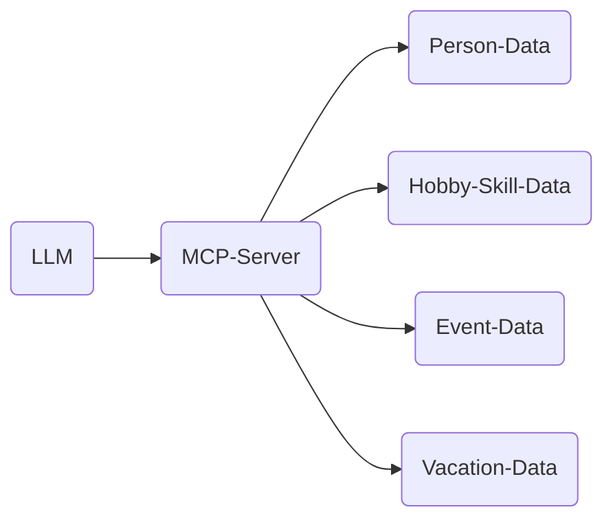
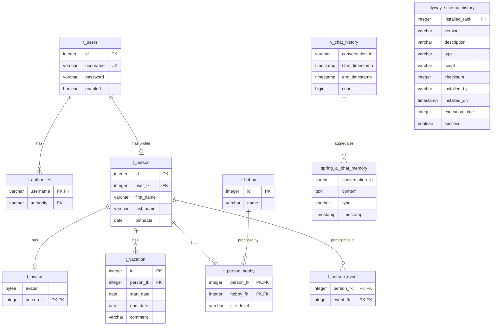

# Contents

1. [Project](#project)
    1. [Tech Stack](#tech-stack)
    2. [Project structure](#project-structure)
    3. [LLM](#llm)
    4. [Running the application](#running-the-application)
    5. [Database](#database)
    6. [Sample Prompts](#sample-prompts)
2. [About my system, for reference](#about-my-system-for-reference)
3. [Issues](#issues)
4. [Inspirations / Documentation](#inspirations--documentation)

# Project

This project is a small demo for Spring AI.  
It provides an MCP-Server to be used by your local LLM and it also features a simple web frontend to as a chat client.  
Since it provides different data for about 80 people, like vacations, hobbies, and events, it is used to show how the
LLM tries to solve your prompt problems with the given MCP-Tools.  
Imagine that you have different applications that store the different data from above and you want to connect your LLM
to that and make the data available.  
This application is meant to be a layer between the LLM and the different data sources / applications.



Basically, this application is an aggregation layer for the LLM to get all the real-time data.

## Tech Stack

- Java 21.0.8
- Maven 3.9.11
- Spring Boot 3.5.7
- Spring AI 1.1.0
- Docker Compose
- PostgreSQL 17
- Vaadin 24.9.4
- LM Studio 0.3.31

## Project structure

Besides the standard Spring Boot Maven structure, we have some additional folders:

* docker: Contains the docker-compose.yml file to start the application and database locally
    * Please verify the `extra_hosts` section in the docker-compose file, it is highly dependent on your local operating
      system and container software.
    * For Rancher Desktop on Mac remove the `extra_hosts` section.
* docker-dev: Contains only the database so that you can start the application from your IDE

## LLM

To use this project you need to run a LLM with tool support and probably thinking enabled; otherwise it did not work for
me.  
I recommend to use [LM Studio](https://lmstudio.dev/) with `openai/gpt-oss-20b` or `qwen/qwen3-4b-thinking-2507` as the model.  
`openai/gpt-oss-20b` has to be set to 16k context to load properly, but it is blazingly fast.  
`qwen/qwen3-4b-thinking-2507` is fast and has a small memory footprint.  
To make sure you can see every setting, turn on Developer Mode.

If you are keen enough, you can also use the OpenAI API directly.  
I tried it with some of the sample prompts, it worked, and the performance was really good, but you have to pay for it.
Change the following configuration in `application.properties`:
```properties
spring.ai.openai.base-url=https://api.openai.com
spring.ai.openai.api-key=$$SUPER_SECRET_KEY$$
spring.ai.openai.chat.options.model=gpt-5-chat-latest
```
If you don't want to use this model, start the app and see what is on offer in the LLM menu section.

### MCP-Server configuration in LM Studio

On the right side under `Program`, `Install` and `Edit mcp.json` you can add this application here as a server:

```json
{
  "mcpServers": {
    "showcase": {
      "url": "http://localhost:58080/mcp"
    }
  }
}
```

That should be enough to get started.
And the tools should be available as soon as you start the application.

### LM Studio server configuration

To allow the application to connect to LM Studio for the chat in the application frontend, you need to navigate to
`Developer` in the left menu.  
Now you can toggle the server, and it should be available under `http://localhost:1234`.
If you want to use LM Studio server in your whole network, you can toggle `serve on local network` in the server
settings.  
Please be aware that this server is not secure and should only be used in a local and trusted network.

## Running the application

## Database



## Sample Prompts

A valid answer for the following prompt should reflect your current local time, so no offsets or timezones.
```
What is the current time?
```

This one should return no, he is not available on 2026-01-05 and his skill level is EXPERT.
```
Is Christopher Meyer available for a cycling event on the 2026-01-05 and what is his skill level?
```

Alternate in the following prompt the date to 2026-01-05. On that date the EXPERT and ADVANCED level cyclists are unavailable.  
If the date in April is used, the result should contain Christopher Meyer (EXPERT) and Hildegart Birnbaum (ADVANCED). 
All other ADVANCED cyclists are on vacation, so the LLM should fall back to the INTERMEDITE level.
```
On 2026-04-30 there is a cycling competition.
I want to find out best cyclist for the competition.
Give me a list of at most 5 persons, that are available and not on vacation.
Since it is a realy important competition I want to prefer skill levels Expert and Advanced, but if there is no one available I want to prefer skill levels Intermediate and than Beginner.
In the result show the persons in a table containing person id, firstname, lastname, birthdate and skilllevel.
Sort the table entries by skilllevel descending, then by birthdate ascending.
Verify your result, no placeholders!
Finally notify the persons in the result that they have been selected for the competition.
```

```
There is a Sudoku tournament in 11 days that we have already entered into our database. We need to enter two attendees and search for the best-fitting people based on the required skill level for the event. Print a detailed table of the selected attendees, including their names, date of birth, skill level and email address. Check that the selected attendees are available. After verification, please notify the selected entrants by email that they have been chosen for the event.
```

# About my system, for reference

(no bragging, just for you to have an idea how the stuff might run on your system)
I am using the following system:

- Linux Mint 22.2
- AMD Ryzen 7 9700X
- 64GB RAM, but not much is used for this project
- XFX 9070 XT 16GB

Performance:

| Prompt                                      | What is the current time?<br/>one tool call   | Is Christopher Meyer available for a cycling event on the 2026-01-05 and what is his skill level?<br/>four to 5 tool calls |
|---------------------------------------------|-----------------------------------------------|----------------------------------------------------------------------------------------------------------------------------|
| qwen/qwen3-4b-thinking-2507                 | ~2 seconds                                    | ~25 seconds                                                                                                                |
| ibm/granite-4-h-tiny                        | ~1 second                                     | ~2 seconds, but failed to get the skill level, because the hobby id was wrong                                              |
| openai/gpt-oss-20b (context reduced to 16k) | ~1 second                                     | ~3 seconds                                                                                                                 |
| microsoft/phi-4-reasoning-plus              | did not terminate / endless loop in reasoning | did not terminate / endless loop in reasoning                                                                              |
| mistralai/magistral-small-2509              | ~25 seconds                                   | ~3 minutes, but failed to get the skill level, because the hobby id was wrong                                              |
| qwen/qwen3-14b                              | ~50 seconds                                   | ~3 minutes                                                                                                                 |

# Issues

- events are not yet implemented
- no differentiation between tools, resources, and prompts
- The frontend does not look very nice yet.
- Due to Vaadin the initial build takes a while.
- Test data is not widespread, it is basically just two specific persons, and the rest is generic.
- Using Ollama is also possible, but the chat in the application will probably not work. Even after switching to Ollama
  Maven dependencies, only the final message was received but no thinking data.
- No tests / no useful tests
- Create tests for performance that can be automated

# Inspirations / Documentation

- [Spring AI](https://spring.io/projects/spring-ai)
- [Vaadin](https://vaadin.com/docs/latest)
- [Github Badges](https://github.com/alexandresanlim/Badges4-README.md-Profile)